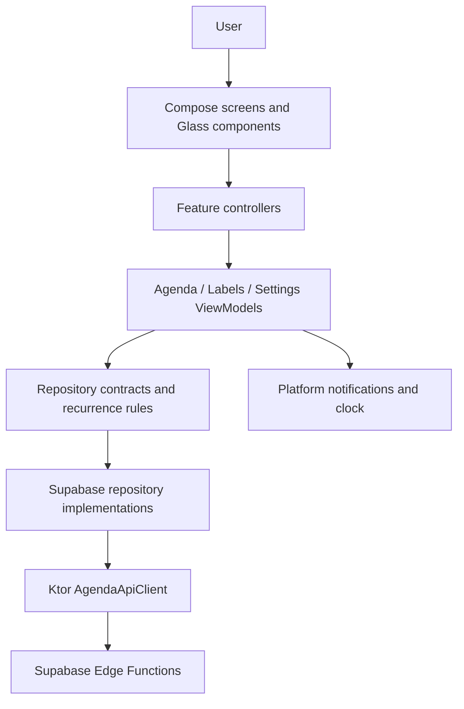

# AI Context Map

## Project identity
- Name: AgendNote
- Type: personal agenda and task manager
- Main platforms: Android and iOS
- Main stack: Kotlin Multiplatform, Compose Multiplatform, Ktor and Supabase
- Current architectural style: feature-based Clean/MVVM with controller-driven UI actions

## Mental model
AgendNote presents four bottom-navigation destinations: Agenda, Calendario, Etiquetas and Ajustes. Shared Compose screens read state from feature ViewModels; controllers translate UI actions into ViewModel calls; repository interfaces isolate the Supabase-backed data implementations. Android and iOS provide platform services such as secrets, clocks and notifications through `expect`/`actual`.

## Conceptual map

## Modules
- `androidApp/`: Android launcher, manifest and application resources.
- `iosApp/`: SwiftUI/Xcode launcher and iOS assets.
- `composeApp/src/commonMain/`: shared application, navigation, UI, domain and data code.
- `composeApp/src/androidMain/`: Android `actual` implementations, including notifications.
- `composeApp/src/iosMain/`: iOS `actual` implementations.
- `supabase/`: schema, policies, migrations and Edge Functions.
- `docs/superpowers/`: accepted feature specifications and implementation plans.

## Cross-cutting concerns
- Navigation: `app/navigation/AppNavHost.kt`, `MainTab.kt` and `NavigationComponents.kt`.
- Dependency wiring: `app/di/AppServices.kt`.
- Theme/design system: `core/ui/theme`, `core/ui/components` and `core/ui/layout`.
- Error handling: feature ViewModels expose human-readable state; the remote-config banner is global.
- Responsive sizing: `AppLayoutMetrics` scales width, height, type and component dimensions.
- Notifications: the common `NotificationService` contract is implemented by
  `AndroidNotificationService`/`AndroidReminderScheduler` and `IosNotificationService`.
  Agenda sends serialized reconciliation commands whenever a day changes.

## Known constraints and gotchas
- Preserve the Glass visual language; improve hierarchy and contrast without replacing it.
- The bottom navigation must reserve layout space globally and never cover screen content.
- All four screens share a maximum phone-content width of 480 dp.
- Supabase can be unavailable when secrets are missing; editing actions must remain disabled then.
- User-created files under `.ai/` and `.claude/` are outside normal product commits.
- Android builds may need workspace-local Gradle/Android homes because global caches can be unwritable.
- Android exact alarms require a separate Android 12+ user grant; scheduling has an inexact fallback.
- Native iOS compilation and notification verification require macOS/Xcode.

## Current quality baseline
- Bottom navigation reserves layout space; destinations must not add legacy 110-140 dp compensation.
- Interactive controls target at least 48 dp, except calendar grids constrained to seven columns.
- Modal forms use the opaque `modalFill` token and remain vertically scrollable.
- Debug and release common unit-test tasks each contain 90 passing tests as of 2026-08-04
  (was 39 as of 2026-07-27).
- The 2026-07-27 handoff is in `docs/FINAL_UI_QA_REPORT.md`. The 2026-08-04 professionalization
  pass (deadline/reminders/subtasks, recurrence end conditions, quick-capture NLP, smart
  lists, templates, export, security error sanitization) is in `docs/agendnote/`, with
  `docs/agendnote/INFORME_FINAL.md` as the top-level summary.
- AgendNote is single-tenant by design (confirmed by the user 2026-08-04) - no Supabase Auth,
  no per-user RLS. See `docs/agendnote/SECURITY_AUDIT.md`.
- No task-editing capability exists anywhere in the app (only create/toggle-done/delete) -
  known, documented gap, not yet scheduled.
